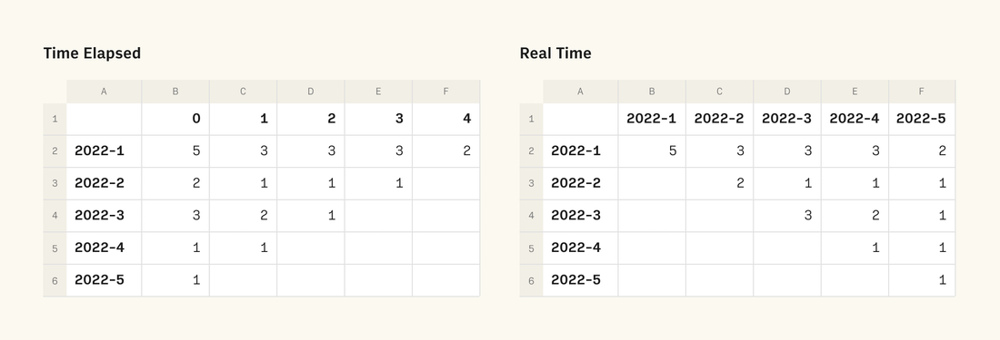

_TL;DR - this is an article about building Cohorts to analyze and simulate business. If you’re the kind of nerd that would rather jump to the spreadsheets themselves and not read the explanation, you can access them all here._

# What are Cohorts?

Your business will evolve. You will launch campaigns, make changes in pricing, hire more people. And you will want to see what’s the effect of those actions. Cause and effect. The easiest way of doing it is to track cohorts.

**Cohorts** are groups of people that share a common characteristic. That allows us to reduce a lot of people into groups that are comparable. As your business progresses with time, the easiest and broader cohorts to track are time-based cohorts, that is, groups of people whose key characteristic is that they did something in a certain period. For eCommerce, for example, time-based cohorts are defined as the group of people who first bought during a certain week. With cohorts, you can answer the following questions:

- How many customers did we acquire this week vs. last week?  Are we accelerating?
- How good is a customer who first purchased during Christmas vs. one which we acquired for Valentines? Who are we retaining and who are we losing?

The simplest cohort table has two axis, and can be rendered in 2 different ways: Time-elapsed or Real-time.

2 different ways to visualize cohort tables.

### Time Elapsed
_left table_ 

- On column A you list the cohorts, that is, the months of first purchases. 2022-1 is for January 2022, 2022-2 for February, etc. 
- On row 1 you list months elapsed, that is, the month since they first purchased. 0 is the month of the first purchase, 1 is the month after that, etc. 
- You can see that 3 people bought for the first time in March of 2022 (row 2022-3, column 0). Of those, 2 came back one month later, and just 1 came back 2 months later. 
- On this table, you will notice that the diagonal is the current month, or May 2022, which is “2022-5” + 0months, “2022-4” + 1 month, “2022-3”+2, etc. 
- This table is great to compare behavior. How many (and what %) are you keeping from month 0 to 1, 2, etc.

### Real Time
_right table_

- Column A is the same as in the Time Elapsed Cohorts above, that is, the months of first purchases. 
- Row 1 is different, and instead of months elapsed it lists real months. Jan 2022, Feb 2022, etc.
- Again, you can see that 3 people bought for the first time in March 2022 (row 2022-3, column 2022-3). And, again, that 2 came back one month later, and just 1 came back 2 months later. 
- On this table, you will notice that each column represents the total of people who purchased on a single month. In April 2022 (2022-4) 7 different people made a purchase.
- This table is great to split months into the contributions from different cohorts.

Note: cohorts can be done per month, week, or any other period.

# How to build cohorts (in Rows)

The following examples are all hosted in [Rows.com](https://rows.com), the spreadsheet platform our team has built. You can (should!) clone this spreadsheet and play around with it, by clicking the + icon. That will create your own copy on your own account!

### Building your first Cohorts

→ You can see the spreadsheet built [here](https://rows.com/humberto/analytics/cohorts-introduction-6EEmgZhfuc2euqbFWCyWTx/live). Duplicate and extend it! 

1. You start with a list of all orders in the table `Sales data`. The minimum information that you need to build a cohort model is a unique identifier for customers (I used the email) and the date of purchase. Believe me, with that you can already build something super powerful. If you want to do other things, you can include spend, number of items on the basket and other information as i did in the example.
2. Then you need to calculate, for each order on that table, some helper columns. Those are all just a few INDEX MATCH functions and other math tricks.
    - `month of the sale` (column D);
    - `month of cohort`: the month of the first purchase of that person, (column E);
    - `months elapsed`: months elapsed between users first purchase (cohort) and month of the current order (column F); and 
    - `purchase in month` for this client: the number of the purchase of this person, within this same month (column H). 
3. Then you can build your cohort table for time-elapsed “Cohorts (elapsed)”. 
    1. On each cell, you will have a COUNTIFS that counts, for each cell, the number of orders for that cohort and elapsed month from distinct individual people.
        - “for that cohort” - the first condition of the COUNTIFS is that the cohort in “sales data” (column F) matches the cohort of the “Cohorts (elapsed)” table (the row of the cell). 
        - “for that elapsed month” - we filter only the elapsed month in “sales data” (column G) that matches the elapsed month in the table (the column of the cell).
        - “from distinct individual people” - we filter the number of the order  of the Column to be 1, as considering only the first purchase counts only unique people. 
        - Note: we lock the cell references of the tables “Sales data” and “Cohorts (elapsed)” as needed, using $ in the formulas. Putting the $ before the column or row locks them. This lets us copy paste any cell within the whole “Cohorts (elapsed)” table to another position and it adapts the references correctly.
    2. I also added an IF function on top (so, IF(COUNTIFS()) to display a “-” on cells that are “impossible”. You can’t have a sale for a month that doesn’t exist.
4. Then, you can build another table that is a version of “Cohorts elapsed” but where cells are a % of the month 0. This is useful to see what % of people comes back, regardless of how many people purchased for the first time.
5. Finally, you can plot the last table in a line chart, as I did.

With a cohort like this, you can:

- understand if you are acquiring more or less customers per period.
- understand if each new cohort of people is returning more or less often.
- extrapolate a natural timely behaviour of people and do projections.
- compare all this with real world actions (campaigns, product changes) and understand the impact of your actions.

### Cohorts with real data

To go one step further, there’s an interesting twist I like to give to cohort analysis, which is to do my cohorts orthogonally. Orthogonal Cohorts are those where variables are independent from each other. So, in a way, instead of doing a big cohort which tracks revenue, you can build several cohorts that track users, orders per user and revenue per order, and then multiply them to build the outcome (revenue).

→ I built this spreadsheet with the much more complete orthogonal cohorts [here](https://rows.com/humberto/analytics/cohorts-for-e-commerce-real-data-7AgSTMDhctsstfl7hUQMxN/a8e012a4-8fb2-44b3-8f70-f1ccbb124fa3/live). 

Check how it looks, or duplicate and play with it by clicking +.

With a cohort like this, you will be able to understand:

- if the higher sales are coming from acquiring more users, users coming back more frequently, the basket of purchases having more items, items growing in  value etc.
- you will also understand across time how those variables are evolving, and compare this to similar businesses.

### Cohorts for simulations

To complete this article, I build one last model for simulating purposes. Here I used a complete, orthogonal cohort model. 

But instead of using real data, I set the individual cohorts tables as editable cells so that you can play around. 

→ Check it [here](https://rows.com/humberto/analytics/cohorts-for-e-commerce-simulator-2tyl566FH2bc8fNtbMvmyI/6ce4e9ad-2e74-47a3-9886-99891384d424/live). If you want it, duplicate it and continue to evolve it!

—

And that’s all about Cohorts for now! If you have any question, post below.
