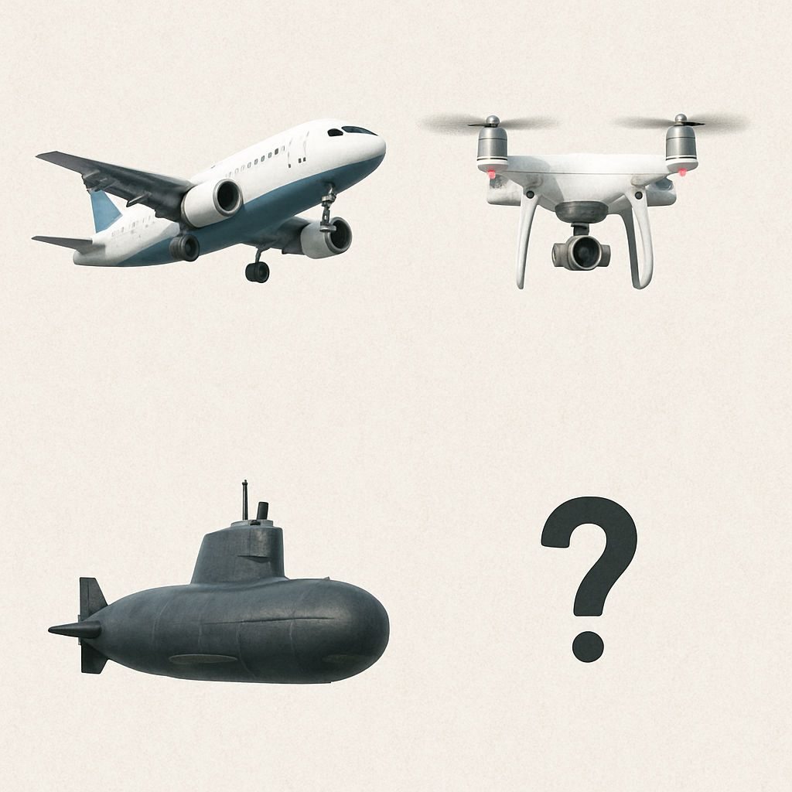

# Underwater drone

Build a high-maneuverability underwater drone.

# Why

We had planes, and now drones are all the rage.

Some drones are just like planes, like the Reaper weaponized drone. But many are of the copter variety, with quad-copters being super common. 

They lose in top speed, but are super maneuverable, able to stand in a position even with strong winds, and rapidly change direction too. 

That makes them more predictable and much easier and safer to use, as they dont need a landing strip. 

They use advances in battery tech and computing to adjust propellers speed many times per second, which gives then the stability and maneuverability.

I think the same can be done in underwater tech.

# Market and Business

TBD.
